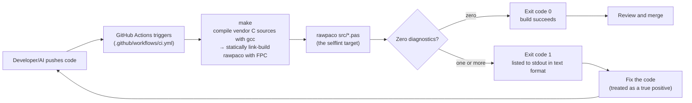
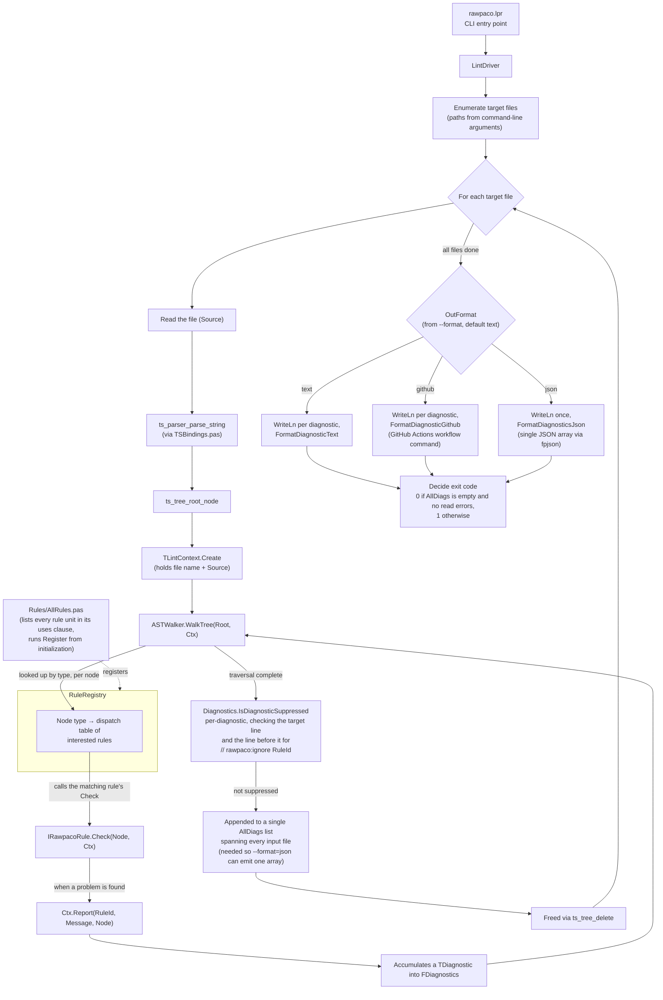
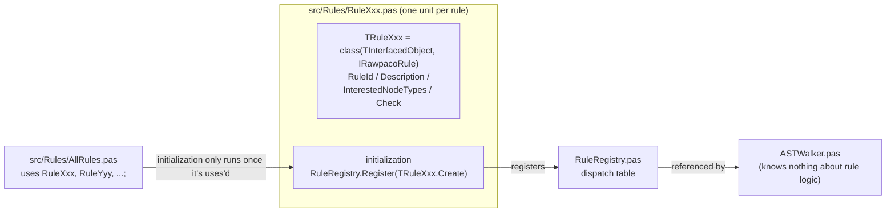

# System Flow Diagrams

*A Japanese translation is kept for reference at [docs/SYSTEM_FLOW_jp.md](SYSTEM_FLOW_jp.md); this English version is canonical.*

This summarizes, as Mermaid diagrams, the overall flow of the rule engine designed in [docs/RULE_ENGINE_DESIGN.md](RULE_ENGINE_DESIGN.md). See the design doc for details and per-element ownership (Sonnet5/Opus5).

The program flow for each source file that actually exists under `src/` at this point in time is documented as individual files under [docs/flows/](flows/).

- [docs/flows/rawpaco_lpr.md](flows/rawpaco_lpr.md) — `src/rawpaco.lpr` (the CLI entry point)
- [docs/flows/tsbindings_pas.md](flows/tsbindings_pas.md) — `src/TSBindings.pas` (a compile/link flow with no runtime logic)
- [docs/flows/win32_atexit_shim_c.md](flows/win32_atexit_shim_c.md) — `src/win32_atexit_shim.c` (a Windows-only `atexit` forwarding shim)

Third-party code under `vendor/` (tree-sitter itself and the generated tree-sitter-pascal parser) is out of scope here.

## 1. GitHub Actions Integration Flow (the external, big-picture view)

Shows how rawpaco is wired into CI and how it affects the development loop.

**Implementation status note (2026-08-04, implemented)**: the `--format=github` option, inline PR annotations, and suppression comments via `// rawpaco:ignore <RuleId>` designed in `docs/RULE_ENGINE_DESIGN.md` section 4 are all implemented. The self-lint target above still uses the default `text` format (CI doesn't need PR-annotation output for its own source), but `--format=github`/`--format=json` are available for other invocations (e.g. wiring rawpaco into a PR-checking workflow step). A false positive in project code now has an escape hatch via `// rawpaco:ignore <RuleId>`, on top of the "any diagnostic found must be fixed" default.

## 2. rawpaco's Internal Execution Flow

The flow within a single run, from `rawpaco.lpr` starting up to it returning an exit code (corresponds to design doc sections 1.1/1.6).

## 3. Static Relationship Between Rule Implementation Units

Shows how the "one rule = one unit" implementation model connects to the traversal/registration machinery (corresponds to design doc section 1.4).

