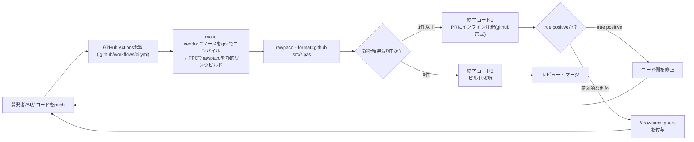
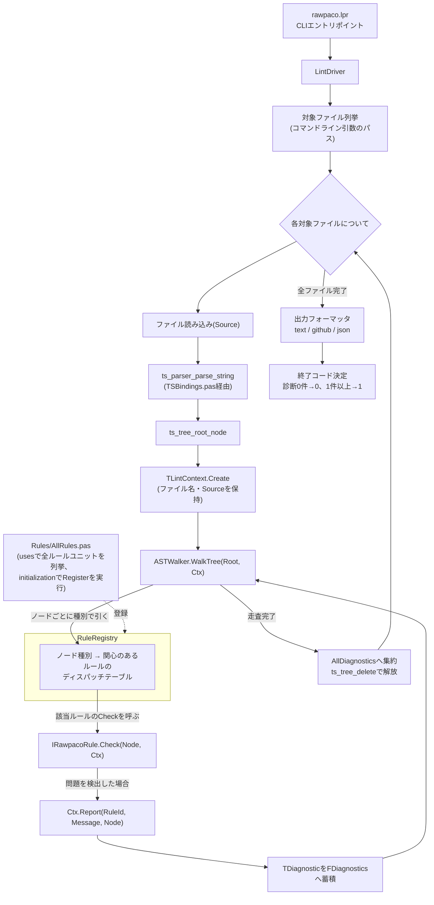

# システムフロー図

[docs/RULE_ENGINE_DESIGN.md](RULE_ENGINE_DESIGN.md) で設計したルールエンジンについて、全体の流れをMermaid図でまとめたものです。設計の詳細・各要素の担当（Sonnet5/Opus5）は設計書側を参照してください。

現時点で `src/` 配下に実際に存在する各ソースファイル単位のプログラムフローは [docs/flows/](flows/) 配下に個別ファイルとしてまとめています。

- [docs/flows/rawpaco_lpr.md](flows/rawpaco_lpr.md) — `src/rawpaco.lpr`（現状は自己チェック用プログラム）
- [docs/flows/tsbindings_pas.md](flows/tsbindings_pas.md) — `src/TSBindings.pas`（実行時ロジックを持たないコンパイル/リンクフロー）
- [docs/flows/win32_atexit_shim_c.md](flows/win32_atexit_shim_c.md) — `src/win32_atexit_shim.c`（Windows専用のatexit転送シム）

`vendor/` 配下の第三者コード（tree-sitter本体・tree-sitter-pascalの生成済みパーサ）は対象外としています。

## 1. GitHub Actions統合フロー（外部から見た全体像）

rawpacoがどのようにCIへ組み込まれ、開発ループに影響するかを示します。



## 2. rawpaco内部の実行フロー

`rawpaco.lpr`が起動してから終了コードを返すまでの、1回の実行内の流れです（設計書1.1/1.6節に対応）。



## 3. ルール実装単位の静的関係

「1ルール=1ユニット」という実装単位が、走査・登録の仕組みとどう繋がるかを示します（設計書1.4節に対応）。

```mermaid
flowchart LR
    subgraph RuleUnit["src/Rules/RuleXxx.pas (ルール1つにつき1ユニット)"]
        Impl["TRuleXxx = class(TInterfacedObject, IRawpacoRule)\nRuleId / Description /\nInterestedNodeTypes / Check"]
        Init["initialization\nRuleRegistry.Register(TRuleXxx.Create)"]
    end

    AllRulesUnit["src/Rules/AllRules.pas\nuses RuleXxx, RuleYyy, ...;"] -->|"usesされて初めてinitializationが走る"| Init
    Init -->|"登録"| RegistryUnit["RuleRegistry.pas\nディスパッチテーブル"]
    RegistryUnit -->|"参照"| WalkerUnit["ASTWalker.pas\n(ルールのロジックは知らない)"]
