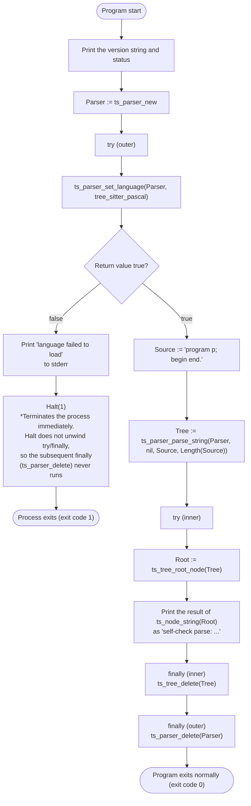

# Program Flow: src/rawpaco.lpr

*A Japanese translation is kept for reference at [docs/flows/rawpaco_lpr_jp.md](rawpaco_lpr_jp.md); this English version is canonical.*

**Implementation status note (2026-08-04, found during review)**: what this file diagrams is only the path taken when `rawpaco.lpr` is launched **with no arguments**. Now that the rule engine (P1–P9, `--only`/`--exclude`) is complete, `rawpaco.lpr` also has a full lint-execution path: given file arguments, it parses `--config`/`--only`/`--exclude` and then calls `LintDriver.RunLint` (note that the "currently" wording below describes the state at the time this file was originally written). For that path, see "2. rawpaco's Internal Execution Flow" in [docs/SYSTEM_FLOW.md](../SYSTEM_FLOW.md).

What follows is the original description (the self-check path taken with no arguments), which is still accurate today.

Currently, `rawpaco.lpr` is not a full lint run but a bootstrap self-check program that confirms tree-sitter-pascal links and works correctly (as noted in [docs/RULE_ENGINE_DESIGN.md](../RULE_ENGINE_DESIGN.md) section 1.1, this content was expected to be replaced by `LintDriver` etc. once the rule engine was implemented).

## Notes

- The outer `try`/`finally` releases `Parser` (acquired by `ts_parser_new`), and the inner `try`/`finally` releases `Tree` (acquired by `ts_parser_parse_string`) — a correspondence that reliably frees, on the FPC side, resources acquired by the tree-sitter C library.
- Since `Halt(1)` on a language-load failure doesn't go through try/finally unwinding, `Parser` is never freed and the whole process just exits. This causes no real harm since the OS reclaims memory on process exit, but the diagram calls it out explicitly as a point where behavior differs from an exception-driven exit.
