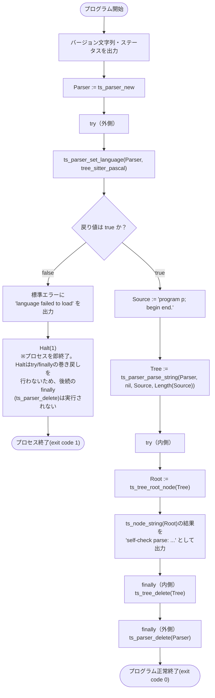

# プログラムフロー: src/rawpaco.lpr

現状の `rawpaco.lpr` は本格的なlint実行ではなく、tree-sitter-pascalが正しくリンク・動作することを確認する自己チェックプログラムです（[docs/RULE_ENGINE_DESIGN.md](../RULE_ENGINE_DESIGN.md) 1.1節で述べている通り、ルールエンジン実装時にこの内容は `LintDriver` 等へ置き換わる想定）。

## 補足

- 外側の `try`/`finally` は `Parser`（`ts_parser_new` で確保）の解放を、内側の `try`/`finally` は `Tree`（`ts_parser_parse_string` で確保）の解放を担当しており、tree-sitterのCライブラリ側で確保したリソースをFPC側で確実に解放する対応関係になっています。
- 言語ロード失敗時の `Halt(1)` はtry/finallyの巻き戻し（アンワインド）を経由しないため、`Parser` は解放されずにプロセスごと終了します。プロセス終了時にOSがメモリを回収するため実害はありませんが、例外による終了とは挙動が異なる点として図に明記しました。
