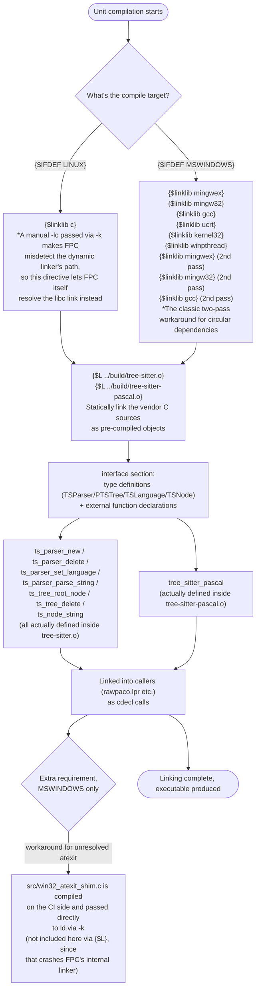

# Program Flow: src/TSBindings.pas

*A Japanese translation is kept for reference at [docs/flows/tsbindings_pas_jp.md](tsbindings_pas_jp.md); this English version is canonical.*

`TSBindings.pas` is a unit with no runtime logic (no `implementation` body). Every function is `external` (an external binding to an object compiled elsewhere), so the "flow" here isn't a runtime processing order — it's a **compile/link flow**: which conditional branches the compiler takes at compile time, and what it ultimately links into.

## Notes

- This file itself has no "procedures that get executed." Every function is `cdecl; external;` (or has an `external name` clause); the actual bodies live in `build/*.o`, compiled from the C sources under `vendor/`.
- Both the `{$linklib}` and `{$L}` directives take effect at **link time**, not at runtime. What the "flow" in the diagram shows is the static decision process by which the compiler resolves an IFDEF branch and ends up with a particular combination of linker arguments and embedded objects.
- The workaround for Windows' unresolved `atexit` symbol (`src/win32_atexit_shim.c`) deliberately falls outside this file's jurisdiction (handled via `-k` on the CI side instead), because embedding it directly into this unit via `{$L}` triggers a crash bug in FPC 3.2.2's win32-target internal linker — an important design fork. See [HANDOFF.md](../../HANDOFF.md) for the full history.
