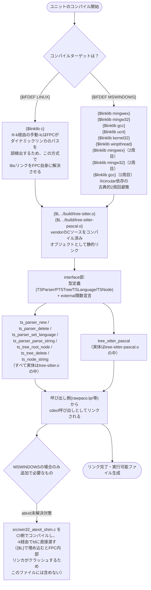

# プログラムフロー: src/TSBindings.pas

*This document is a Japanese translation kept for reference. The canonical, up-to-date version is [docs/flows/tsbindings_pas.md](tsbindings_pas.md) (English).*

`TSBindings.pas` はユニットであり、実行時のロジック（`implementation`部）を持ちません。すべての関数が `external`（他所でコンパイル済みのオブジェクトへの外部バインディング）であるため、ここでの「フロー」は実行時の処理順序ではなく、**コンパイル時にどの条件分岐が選択され、最終的にどうリンクされるか**というコンパイル/リンクフローになります。

## 補足

- このファイル自体に「実行される手続き」は存在しません。すべての関数は `cdecl; external;` （またはexternal name指定）であり、実体は `vendor/` 配下のCソースをコンパイルした `build/*.o` 側にあります。
- `{$linklib}` ディレクティブと `{$L}` ディレクティブは、いずれも実行時ではなく**リンク時**に効果を持ちます。図中で「フロー」として示しているのは、コンパイラがどのIFDEF分岐を通り、最終的にどんなリンカ引数・埋め込みオブジェクトの組み合わせに帰着するかという静的な決定過程です。
- Windows向けの `atexit` 未解決シンボル対策（`src/win32_atexit_shim.c`）は、`{$L}` でこのユニットに直接埋め込むとFPC 3.2.2のwin32ターゲット内部リンカがクラッシュするバグを踏むため、あえてこのファイルの管轄外（CI側で`-k`経由）としている点が設計上の重要な分岐点です。詳細な経緯は [HANDOFF.md](../../HANDOFF.md) を参照してください。
