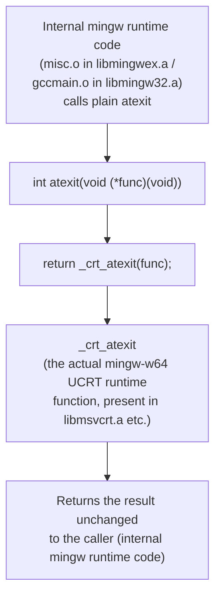

# Program Flow: src/win32_atexit_shim.c

*A Japanese translation is kept for reference at [docs/flows/win32_atexit_shim_c_jp.md](win32_atexit_shim_c_jp.md); this English version is canonical.*

A forwarding shim from `atexit` to `_crt_atexit`, needed only on Windows (mingw-w64, UCRT). A single, very simple function, but the reason it exists matters, so it's documented here with a diagram and notes.

## Notes

- The vendor tree-sitter / tree-sitter-pascal C sources themselves never call `atexit`. The callers are objects inside the linked mingw-w64 runtime libraries (`libmingwex.a`/`libmingw32.a`).
- The pinned mingw-w64 (niXman mingw-builds 16.1.0, UCRT) exposes no plain `atexit` symbol in any of its import libraries. On UCRT, `atexit` is only provided via inline expansion from `<stdlib.h>`, with `_crt_atexit` as the actual implementation. Objects brought in without going through that header (i.e., compiled directly with `gcc -c`) never get that inline expansion, so a plain `atexit` symbol doesn't exist anywhere and linking fails.
- This file is **not** embedded via `src/TSBindings.pas`'s `{$L}`. FPC 3.2.2's win32 target uses its internal linker by default, and embedding it that way triggers a bug that crashes the compiler itself (see [HANDOFF.md](../../HANDOFF.md) for details). Instead, it's compiled with `gcc -c` on the CI side (`.github/workflows/ci.yml`) and passed directly to the external linker (`-Xe`) via `-k`.
- This file is never compiled or used in the Linux build (Windows-only).
