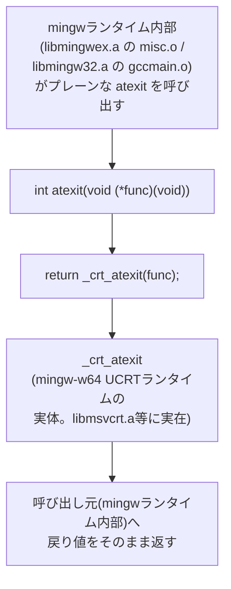

# プログラムフロー: src/win32_atexit_shim.c

*This document is a Japanese translation kept for reference. The canonical, up-to-date version is [docs/flows/win32_atexit_shim_c.md](win32_atexit_shim_c.md) (English).*

Windows(mingw-w64, UCRT)向けにのみ必要な、`atexit` から `_crt_atexit` への転送シムです。非常に単純な1関数のみのファイルですが、存在理由が重要なため図と補足に残します。

## 補足

- vendorの tree-sitter / tree-sitter-pascal のCソース自体は `atexit` を呼び出しません。呼び出しているのは、リンクしている mingw-w64 のランタイムライブラリ（`libmingwex.a`/`libmingw32.a`）内部のオブジェクトです。
- pinしているmingw-w64（niXman mingw-builds 16.1.0, UCRT）は、どのインポートライブラリにもプレーンな `atexit` シンボルを公開していません。UCRT環境では `<stdlib.h>` のインライン展開経由でのみ `atexit` が提供され、実体は `_crt_atexit` です。ヘッダを経由しない形（`gcc -c` での直接コンパイル）で持ち込まれたオブジェクトは、このインライン展開を経ないため、プレーンな `atexit` シンボルがどこにも存在せずリンクエラーになります。
- このファイルは `src/TSBindings.pas` の `{$L}` では**埋め込みません**。FPC 3.2.2のwin32ターゲットは既定で内部リンカを使い、これで埋め込むとコンパイラ自体がクラッシュするバグがあるためです（詳細は [HANDOFF.md](../../HANDOFF.md) 参照）。代わりにCI（`.github/workflows/ci.yml`）側で `gcc -c` によりコンパイルし、外部リンカ（`-Xe`）に `-k` 経由で直接渡しています。
- Linuxビルドではこのファイルは一切コンパイル・使用されません（Windows専用）。
